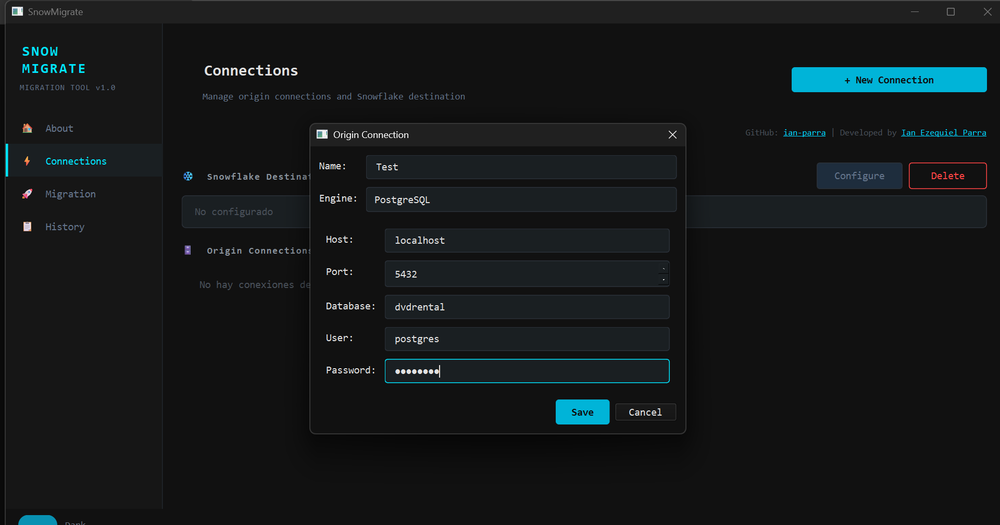
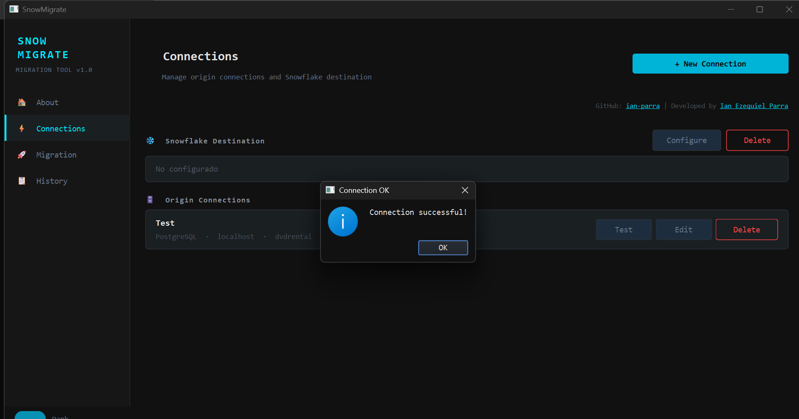
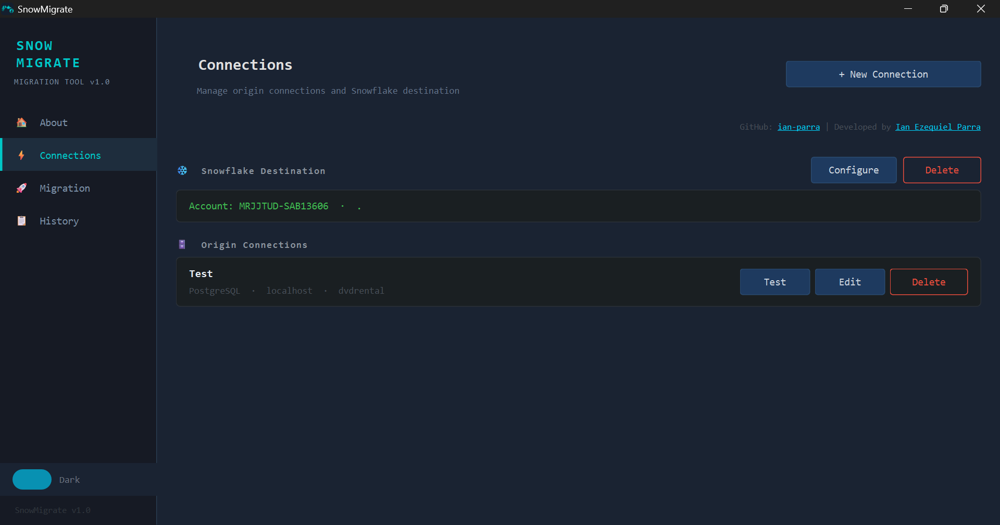
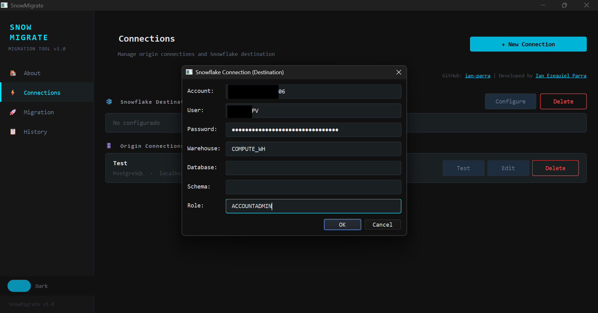
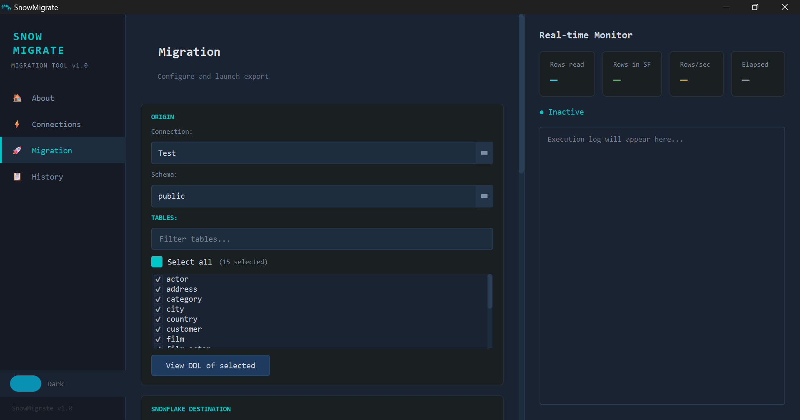
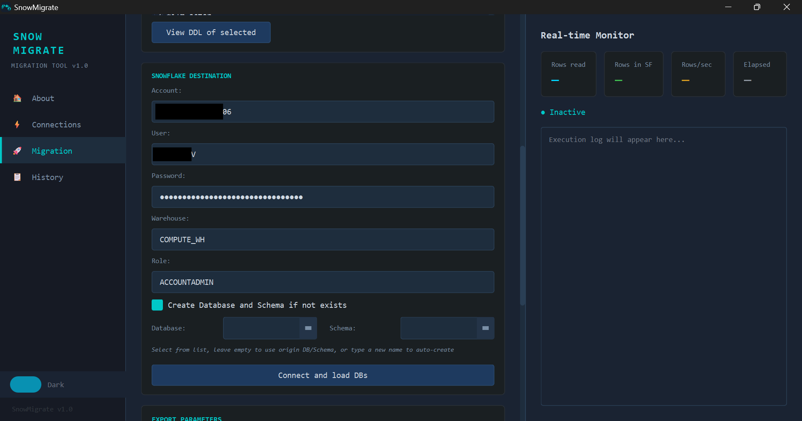
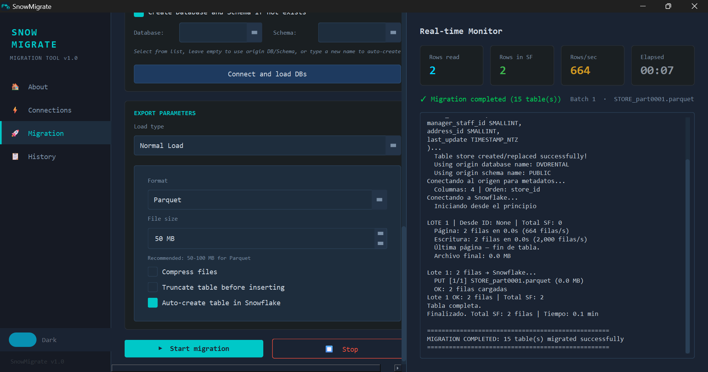
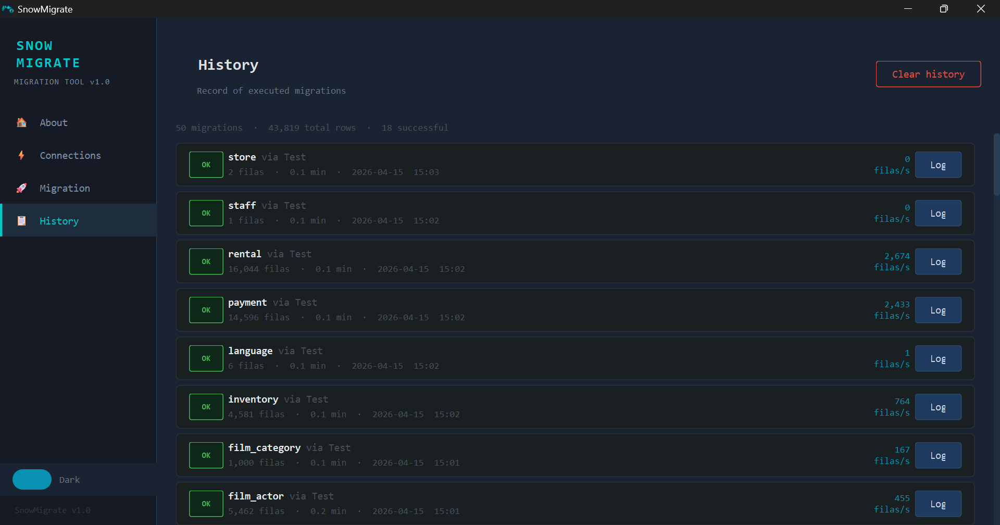
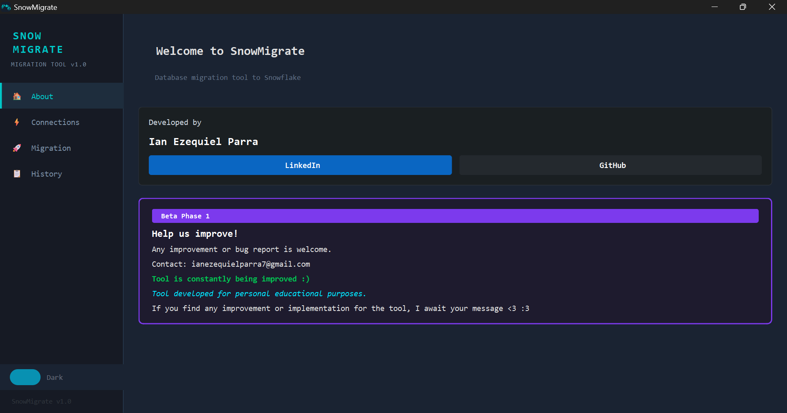

# SnowMigrate

Desktop tool for migrating databases (PostgreSQL, SQL Server, MySQL) to Snowflake.

# User Guide

### Table of Contents
1. [Getting Started](#getting-started)
2. [Connections Page](#connections-page)
3. [Migration Page](#migration-page)
4. [History Page](#history-page)
5. [About Page](#about-page)

---

## Getting Started

Welcome to **SnowMigrate**, a desktop application for migrating data from traditional databases (PostgreSQL, SQL Server, MySQL) to Snowflake.

### Installation
1. Download the installer from the [releases page](https://github.com/ian-parra/SNOWMIGRATE/releases/tag/v1.0.0)
2. Run `SnowMigrate-Setup-x.x.x.exe`
3. Follow the installation wizard

---

## Connections Page

The Connections page is where you configure your source databases and Snowflake destination.

### Adding a Source Connection

1. Select the database type: **PostgreSQL**, **SQL Server**, or **MySQL**
2. Enter the connection details:
   - **Connection Name**: A friendly name for this connection
   - **Host**: Server hostname or IP address
   - **Port**: Default ports are 5432 (PostgreSQL), 1433 (SQL Server), 3306 (MySQL)
   - **Database**: Database name
   - **Username**: Database username
   - **Password**: Database password
3. Click **Save Connection**
4. Use the **Test** button to verify the connection works

### Managing Connections

- **Edit**: Modify existing connection details
- **Delete**: Remove a saved connection
- **Connect**: Use this connection for migration

### Configuring Snowflake Destination

1. In the **Snowflake Destination** section, enter:
   - **Account**: Your Snowflake account identifier
   - **User**: Snowflake username
   - **Password**: Snowflake password
   - **Warehouse**: Select or enter warehouse name
   - **Role**: Select or enter role
   - **Database**: Target database name
   - **Schema**: Target schema name
2. Click **Save Connection** to store these credentials

> **Note**: Credentials are securely stored using Base64 encoding.

---

## Migration Page

The Migration page is where you select tables and execute the migration.

### Step 1: Select Source

1. Choose a **Source Connection** from the dropdown
2. Select the **Schema** containing the tables you want to migrate

### Step 2: Select Tables

1. Use the **Filter** input to quickly find specific tables
2. Check the **Select All** checkbox to choose all tables
3. Or check individual tables you want to migrate
4. Click **View DDL** to see the table structure before migration

### Step 3: Configure Snowflake Destination

Expand the **Snowflake Destination** section and verify:
- Account, User, Password
- Warehouse, Role
- Database, Schema

### Step 4: Configure Load Options

#### Normal Load
Use for basic migration with default settings:
- **Format**: Choose CSV or Parquet
- **File Size**: Target file size in MB
- **Compress**: Enable GZIP compression

#### Advanced Load
Use for customized migration:
- **Page Size**: Number of rows per query (default: 100,000)
- **Target File Size**: Maximum file size in MB (default: 100)
- **Batch Files**: Number of files per batch (default: 20)
- **Reconnect Wait**: Seconds to wait before reconnecting (default: 15)
- **Max Reconnects**: Maximum reconnection attempts (default: 20)
- **Output Directory**: Custom directory for temporary files

#### Migration Mode
- **Streaming**: Exports directly to Snowflake in batches
- **Download First**: Downloads to local storage first, then uploads

#### Additional Options
- **Truncate Table**: Clear existing data before loading
- **Auto-create Table**: Automatically create table in Snowflake if not exists

### Step 5: Start Migration

1. Click **Start Migration** to begin
2. Monitor progress in the **Real-Time Monitor** section:
   - **Rows Read**: Total rows read from source
   - **Rows in Snowflake**: Total rows loaded
   - **Rows/sec**: Migration speed
   - **Elapsed Time**: Duration of migration
3. View the **Log** panel for detailed execution logs
4. Click **Stop** to cancel the migration if needed

---

## History Page

The History page displays all previous migration attempts.

### Viewing History

The history table shows:
- **Start Time**: When migration began
- **End Time**: When migration finished
- **Tables**: Number of tables migrated
- **Status**: 
  - ✅ **OK**: Migration completed successfully
  - ❌ **ERR**: Migration failed
  - ⏹ **STOP**: Migration was stopped by user
- **Rows**: Total rows migrated
- **Duration**: Total time taken
- **Speed**: Rows per second

### Actions

- **View Log**: See detailed execution log for a specific migration
- **Delete**: Remove a history entry

---

## About Page

The About page provides information about SnowMigrate.

### Information Displayed
- Application logo and name
- Version number
- Developer information
- Links to GitHub and LinkedIn

---

## Tips & Best Practices

1. **Test Connections First**: Always test your connections before starting a migration
2. **Start with Normal Load**: Use Advanced Load only if you need to customize performance
3. **Monitor Progress**: Keep an eye on the real-time monitor during migration
4. **Check History**: Review the History page to track migration performance over time
5. **Backup Data**: When using "Truncate Table", ensure you have backups if needed

---

# SnowMigrate - Features Roadmap

---

## Connectivity

| Feature | Description |
|---------|-------------|
| PostgreSQL source | Connection to PostgreSQL databases (port 5432) |
| SQL Server source | Connection to SQL Server (port 1433) |
| MySQL source | Connection to MySQL (port 3306) |
| Snowflake connection | Snowflake destination configuration |
| Connection testing | Validation of connection to each engine |
| Multiple connections | Management of multiple source connections (JSON) |
| Secure credentials | Base64 encoded storage |
| Delete Snowflake connection | Remove Snowflake destination connections |

---

## Migration Engine

| Feature | Description |
|---------|-------------|
| Streaming mode | Exports directly to Snowflake in batches |
| Download-first mode | Downloads locally first, then uploads |
| CSV format | Export in CSV format |
| Parquet format | Export in Parquet format |
| GZIP compression | Optional file compression |
| Keyset pagination | Optimization for large tables |
| Automatic retries | Automatic reconnection on failure |
| Resume capability | Saves progress to continue interrupted migrations |

---

## Export Configuration

### Normal Load
| Parameter | Description | Default Value |
|-----------|-------------|---------------|
| Format | CSV or Parquet | CSV |
| File size | Target file size (MB) | 100 |
| Compression | GZIP compression | Optional |

### Advanced Load
| Parameter | Description | Default Value |
|-----------|-------------|---------------|
| Page size | Rows per query | 100,000 |
| Target file size | Max file size (MB) | 100 |
| Batch files | Files per batch | 20 |
| Reconnect wait | Reconnection wait (sec) | 15 |
| Max reconnections | Max reconnection attempts | 20 |
| Output directory | Export path | Configurable |

---

## Migration Options

- [x] Truncate table (truncate table before loading)
- [x] Auto-create tables in Snowflake
- [x] Auto-create Database/Schema
- [x] File compression
- [x] Multi-table selection
- [x] Real-time table filtering
- [x] View DDL of selected tables

---

## User Interface

### Themes
- Dark industrial theme (default) with cyan accents
- Light theme available
- Toggle to switch between themes

### Pages
1. **Connections** - Source and destination connection management
2. **Migration** - Main migration panel
3. **History** - Migration history
4. **About** - Project information

### UI Features
- Navigation sidebar
- Custom widgets (ThemeToggle, Cards, Buttons)
- Monospace style (Consolas/Courier New)
- Multi-table selector
- Real-time monitoring with statistics

---

## Real-Time Monitor

| Metric | Description |
|---------|-------------|
| Rows read | Total rows read from source |
| Rows in Snowflake | Total rows loaded |
| Rows/second | Migration speed |
| Elapsed time | Migration duration |
| Execution log | Live process log |

---

## History & Logs

- Migration history with status (OK, ERR, STOP)
- Detailed logs visualization
- Metrics: exported rows, duration, speed

---

## Coming Soon

- [ ] Notification-based update system
- [ ] Validation section
- [ ] Migration from Oracle database
- [ ] Migration from MongoDB
- [ ] Migration from MariaDB
- [ ] Migration from Cassandra

## Supported Databases

| Database   | Status |
|------------|--------|
| PostgreSQL | ✅      |
| SQL Server | ✅      |
| MySQL      | ✅      |

## Version History

| Version | Date       | Changes |
|---------|------------|---------|
| 1.0     | 2026       | Initial release |

## Support

For issues or questions, open an issue on GitHub.

## Authors

**Ian Ezequiel Parra**

**Kevin Villota**

*Last updated: April 2026*
